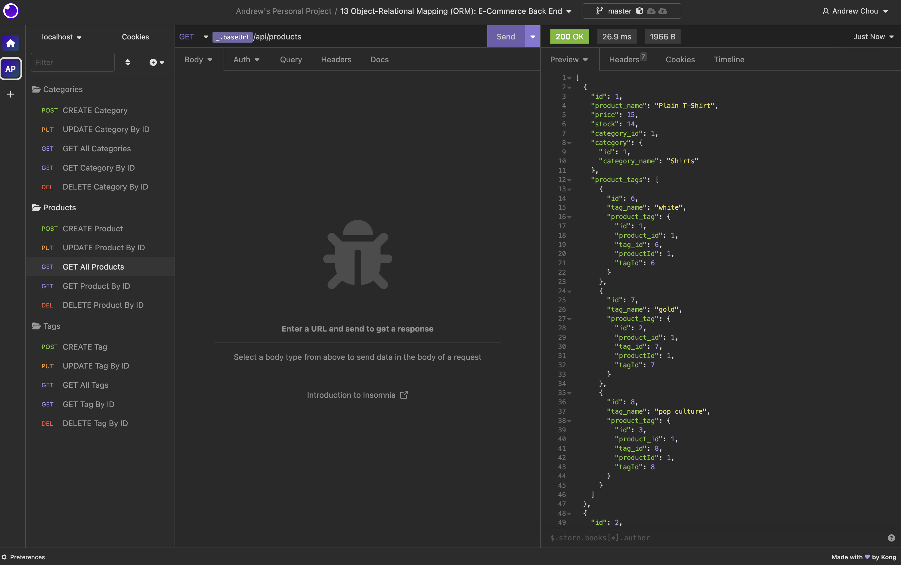

# Andrew's E-Commerce BackEnd

## 🔎 Overview:

> - Hiding database configuration sensitive information (DB_NAME, DB_USER, and DB_PASSWORD) by utilizing [dotenv](https://www.npmjs.com/package/dotenv)
>
> - Connecting to MySql database using [MySQL2](https://www.npmjs.com/package/mysql2)
>
> - Utilizing [Sequelize](https://www.npmjs.com/package/sequelize) as the Object-Relational Mapping (ORM) tool to simplify and streamline database interactions
>
> - To install dependencies, run "npm i" and then start the application with "node index"
>
> - Accessing the db folder, use the command "mysql -u root -p" to enter the MySQL terminal. After entering your password, execute the commands "source schema.sql" to set up the database
>
> - Use the command "npm run seed" or "node seeds/index.js" to initiate and set up the tables
>
> - Execute the command "npm run watch" or "nodemon server.js" to enhance the speed and efficiency of Node.js application development
>
> **Note**: Don't forget to rename '.env.Example' to '.env' and update the default settings with your own

## 🎬 Link Of The Video:

❗❗❗ ☛ [Database Setup & Seeding](https://watch.screencastify.com/v/rQXKnyQXUDwdIbTAsF3k) ☚ ❗❗❗
[(Backup Drive Link)](https://drive.google.com/file/d/1SqVCkUcX7AE3meHwNt0HjlO_FZLfhRlv/view)

❗❗❗ ☛ [API Test For /api/categories](https://watch.screencastify.com/v/IZ0ntd8aV8ZbJk9fDrp9) ☚ ❗❗❗
[(Backup Drive Link)](https://drive.google.com/file/d/1MVjuHdiP7iP31vpE_5Xw9L08MaEpsYhb/view)

❗❗❗ ☛ [API Test For Api Routes: Products & Tags](https://watch.screencastify.com/v/aQRgJOkCRk9wgRd33C9Q) ☚ ❗❗❗
[(Backup Drive Link)](https://drive.google.com/file/d/1RSkkBU6fDvVwUCX85XtlJ9a_s6K5TFrW/view)

```
Video's URL (Google Drive):

Database Setup & Seeding:
https://drive.google.com/file/d/1SqVCkUcX7AE3meHwNt0HjlO_FZLfhRlv/view

API Test For /api/categories:
https://drive.google.com/file/d/1MVjuHdiP7iP31vpE_5Xw9L08MaEpsYhb/view

API Test For Api Routes: Products & Tags:
https://drive.google.com/file/d/1RSkkBU6fDvVwUCX85XtlJ9a_s6K5TFrW/view

(If the link is not functional, please refer to the gif demonstration at the bottom of the document for guidance.)
```

## 📷 Screenshots Of The Applications:

|  |
| :-------------------------------: |
|  _↑ Overview of the Insomnia ↑_   |

|  |
| :------------------------------------------------------------------: |
|                        _↑ Databse Seeding ↑_                         |

|  |
| :-----------------------------------------------------------------: |
|                  _↑ API Test For Api/Categories ↑_                  |

|  |
| :--------------------------------------------------------------------: |
|                   _↑ API Test For Products & Tags ↑_                   |

---

© 2023 edX Boot Camps LLC. Confidential and Proprietary. All Rights Reserved.
